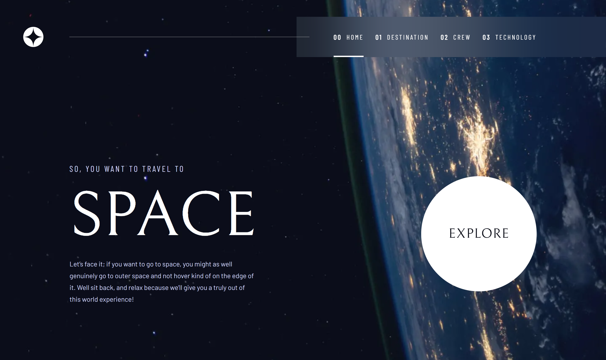

# Space Toursim Website

This is a solution to the [Space tourism website challenge on Frontend Mentor](https://www.frontendmentor.io/challenges/space-tourism-multipage-website-gRWj1URZ3).

## Table of contents

  * [Overview](#overview)
    * [The challenge](#the-challenge)
    * [Screenshot](#screenshot)
    * [Links](#links)

  * [My process](#my-process)
    * [Built with](#built-with)
    * [What I learned](#what-i-learned)
    * [Continued development](#continued-development)
    * [Useful resources](#useful-resources)
  * [Author](#author)

## Overview

### The Challenge

Users Can:

- View the optimal layout for each of the website's pages depending on their device's screen size
- See hover states for all interactive elements on the page
- View each page and be able to toggle between the tabs to see new information

### Screenshot



### Links

- Solution URL: [Add solution URL here](https://your-solution-url.com)
- Live Site URL: [Add live site URL here](https://your-live-site-url.com)

## My process

### Built with

- Semantic HTML5 Markup
- CSS Custom Properties
- Flexbox
- CSS Grid
- Mobile-First Workflow
- Typescript - For Type Safety
- TailwindCSS - For Styles
- AstroJS Framework
- ThreeJS - Javascript 3D Animation Library

### What I learned

There was a lot of things I learn't along the way while building this project, from things that I hadn't used in a while and had to jog my memory on, to things that were completely new to me.

The main things I learn't that were new to me are:
- The Navigation API & the View Transition API
- AstroJS' Content Collections
- Working with ThreeJS & using 3D Models

Some concepts that I had used in the past but was a bit rusty with were:
- Vanilla Javascript DOM Manipulation
- Event Delegation

---

#### The Navigation API & the View Transition API

##### The View Transition API

The viewTransitionAPI is a native browser API that enables us to create different types of animations when switching between different pages on a website (Multi-page App) or animation between different DOM states (Single-page App). It's a very versatile and powerful API that can be used in both SPA Applications and multi-page Websites. We can also target specific elements on the page to only apply the transitions animations to, instead of applying to the whole page or even every page.

It works creating two different snapshots of page, the old & new, then transitions the old one out and replaces it with then new.

In this project I opted to only use it when transitioning between the different tab/slide states that are on the destination, crew & technology pages. I didn't use it when transitioning between the main pages themselves. This is the single-page way of using the API by switching between the different DOM states.

In order to do this you have to use the **startViewTransition** call back function in javascript to activate the view transition and you also have to assign a specific name in css using the **view-transition-name** property to the elements you want to animate, you can then add any styles you want to apply to those elements for when the view transition takes effect. In CSS you can also apply different animations for old or exiting elements/pages and the new or entering elements/pages by targeting the old or new snapshot of the pages or dom elements.

```js
document.startViewTransition(async () => {
    // ...Additional code
  });
```

```css
  #crew-info {
  view-transition-name: crew-info;
  }
  ::view-transition-old(crew-info){
  animation: fade-out-left 1.5s forwards;
  }
  ::view-transition-new(crew-info) {
  animation: fade-in-right 1.5s forwards;
}
```

##### The Navigation API

The Navigation API is used as a way of managing and using different browser actions. It can be really powerful when used in Single-page apps, where we will have to handle the different types of navigation ourselves manually. It also helps us avoid using the HistoryAPI, which was the old way of doing this but really wasn't designed to handle the ways we need to control the navigation in a single-page application.
We use it be accessing the navigation instance and we can use this instance to access all the different types of navigation actions in one place. 

In this project, I used it by listening for the navigate eventlistener attached to the navigation instance, which is fired when any type of navigation is initiated. I then used the callback function to manage the navigation and get it to do what I need it to do. The navigation event is automatically passed in as a prop into this callback function which we can then use.

The Navigation event allows us to access a method called **intercept()**. It lets us decide what happens when the navigation happens and what happens just before the navigation. I used this method to fetch the new content and render it for the new page, whenever someone navigates between the different tabs.

```ts
navigation.addEventListener("navigate", (e) => {
  if (!e.canIntercept) return;
  if (
    !isDestination(e.destination.url) &&
    !isCrew(e.destination.url) &&
    !isTechnology(e.destination.url)
  )
    return;

  const urlPathArray = new URL(e.destination.url).pathname
    .trim()
    .split("/")
    .filter(Boolean);

  const page = urlPathArray[0];
  const slug = urlPathArray[1];
  //
  e.intercept({
    async handler() {
      const response = await fetch(`/api/${page}/${slug}`);
      const data = await response.json();
      //
      document.startViewTransition(async () => {
        if (page === "destination") {
          updateDestinationContent(data);
        }
        if (page === "crew") {
          updateCrewContent(data);
        }
        if (page === "technology") {
          updateTechContent(data);
        }
      });
    },
  });
});
```


#### AstroJS' Content Collections


#### Working with ThreeJS & using 3D Models

---

#### Vanilla Javascript DOM Manipulation

#### Event Delegation

---

### Continued Development

#### AstroJS
  Going forward I will be using AstroJS a lot more in my projects, especially for static sites like this one. AstroJS allows me to start off slow and slowly build up complexity as and when I need it. It allows me to use different frameworks into it if I need to use them, it runs on the server side so is good for SEO & works well when working with high content driven websites. As it provides a way to render content from markdown files using AstroJS' built-in Content Collections, while also being able to seemingly work with most CMS.

  These are just a small few benefits of using AstroJS and I look forward to discovering many more as I build more project with it in the future.

#### Navigation API & the viewTransition API
  The Navigation & the viewTransition APIs are two browser native APIs I hadn't mush experience with before this project and I will most likely be using them a lot more in future projects.


### Useful Resources

- [AstroJS Docs](https://docs.astro.build/en/getting-started/)

- [AstroJS Content Collections Docs](https://docs.astro.build/en/guides/content-collections/)

- [AstroJS API Endpoint Docs](https://docs.astro.build/en/guides/endpoints/)

- [MDN Docs - Navigation API](https://developer.mozilla.org/en-US/docs/Web/API/Navigation_API)

- [MDN Docs - ViewTransition API](https://developer.mozilla.org/en-US/docs/Web/API/ViewTransition)

- [Google Developers Docs - Navigation API](https://developer.chrome.com/docs/web-platform/navigation-api)

- [Web.dev Docs - Navigation API Blog](https://web.dev/blog/baseline-navigation-api)

- [Coding in Public | YouTube Video - ViewTransition API  Video](https://www.youtube.com/watch?v=LAozCuoZXm0)

- [Syntax | YouTube Video - ViewTransition API  Video](https://www.youtube.com/watch?v=jnYjIDKyKHw)

- [Kevin Powell | YouTube Video - ViewTransition API  Video](https://www.youtube.com/watch?v=quvE1uu1f_I)

- [Gabriel Molter | YouTube Video - Adding a 3D model to a website using THREE.JS  Video](https://www.youtube.com/watch?v=lGokKxJ8D2c)

- [NASA - 3D-Model Resources](https://science.nasa.gov/3d-resources/)
  - [Europa | NASA - 3D-Model Resource](https://science.nasa.gov/resource/europa-3d-model/)
  - [Mars | NASA - 3D-Model Resource](https://science.nasa.gov/resource/planet-mars-3d-model/)
  - [Moon | NASA - 3D-Model Resource](https://svs.gsfc.nasa.gov/14959/)
  - [Titan | NASA - 3D-Model Resource](https://science.nasa.gov/resource/titan-3d-model/)

- [ThreeJS](https://threejs.org/)
  - [ThreeJS Docs - Fundamentals](https://threejs.org/manual/#en/fundamentals)
  - [ThreeJS Docs - Loading a .GLTF File](https://threejs.org/manual/#en/load-gltf)
  - [ThreeJS Docs - Loading 3D Models](https://threejs.org/manual/#en/loading-3d-models)

- [Model View Component](https://modelviewer.dev/)

  - [Web.dev Article - The model-viewer web component](https://web.dev/articles/model-viewer)

## Author

- Portfolio - [www.djhwebdevelopment.com](https://www.djhwebdevelopment.com)
- Frontend Mentor - [@David-Henery4](https://www.frontendmentor.io/profile/David-Henery4)
- Github - [David-Henery4](https://github.com/David-Henery4)
- LinkedIn - [David Henery](https://www.linkedin.com/in/david-henery-725458241)
